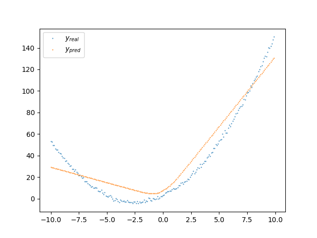

# d
This is my toy deep learning library 🤍  

Have a nice day!

# Usage

[`tst2.py`](./tst2.py):
```python
from inspect import isfunction
import numpy as np
import matplotlib.pyplot as plt
from base.tensor import Tensor
from base.compose import Linear
from base.ops import relu

x = np.arange(-10, 10, .1)
y = x**2 + 5*x + 3 + np.random.randn(*x.shape)

x_t = Tensor(x).reshape((-1, 1))
y_t = Tensor(y).reshape((-1, 1))

l1 = Linear(1, 64, need=True)
l2 = Linear(64, 1, need=True)

stack = [l1, relu, l2]

num_epoch = 5
lr = 2e-3

for i in range(num_epoch):
    t = x_t
    for block in stack:
        t = block(t)
    y_t_ = t

    loss = ((y_t - y_t_)**2).sum() / y_t.shape[0]
    print(f"epoch {i+1:>2}: {loss=}")

    loss.back()
    for block in stack:
        if not isfunction(block):
            for p in block.params:
                block.params[p].update_decr(lr * block.params[p]._grad_acc)
    loss.reset_grad()

plt.scatter(x_t.numpy(), y_t.numpy(), s=0.25, label='$y_{\t{real}}$')
plt.scatter(x_t.numpy(), y_t_.numpy(), s=0.25, label="$y_{\t{pred}}$")
plt.legend()
plt.show()
```  

Output:  
```
epoch  1: loss=Tensor(2988.6180533117613, need=True)
epoch  2: loss=Tensor(175.11636741436078, need=True)
epoch  3: loss=Tensor(135.57954117903157, need=True)
epoch  4: loss=Tensor(128.1197327011424, need=True)
epoch  5: loss=Tensor(122.81316604999608, need=True)
```  

Plot:  


# Inspirations
0. micrograd (not very relevant to me but ifykyk)
1. tinygrad
2. jax
3. pytorch
